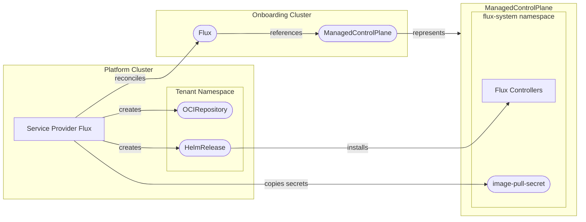

[](https://api.reuse.software/info/github.com/openmcp-project/service-provider-flux)

# 🚀 service-provider-flux

A service provider for managing [FluxCD](https://fluxcd.io/) deployments within a ManagedControlPlane environment. This provider enables GitOps capabilities by automatically installing and configuring Flux on managed control planes.

## 📖 Overview

The Flux service provider automates the lifecycle management of Flux installations, including:

- 🔄 **Automated Flux Deployment** - Deploys Flux via Helm to ManagedControlPlanes
- 🔐 **Air-Gapped Support** - Full support for private registries and air-gapped environments
- 🔑 **Secret Management** - Automatic copying of registry credentials across cluster boundaries
- 📊 **Status Tracking** - Real-time status reporting of all managed resources

## 🏗️ Architecture



## 🚦 Getting Started

### Prerequisites

- Go 1.21+
- [Task](https://taskfile.dev/) (task runner)
- Docker (for building images)
- Access to an openMCP environment

### 🛠️ Local Development

1. **Clone the repository**
   ```bash
   git clone https://github.com/openmcp-project/service-provider-flux.git
   cd service-provider-flux
   ```

2. **Install dependencies**
   ```bash
   go mod download
   ```

3. **Build the binary**
   ```bash
   task build
   ```

4. **Run tests**
   ```bash
   task test
   ```

5. **Build the container image**
   ```bash
   task build:img:build
   ```

### 🧪 Running End-to-End Tests

```bash
task test-e2e
```

This will build the image and run the full e2e test suite.

## 📦 Installation

To install the Flux service provider, create a `ServiceProvider` resource in your platform cluster:

```yaml
apiVersion: openmcp.cloud/v1alpha1
kind: ServiceProvider
metadata:
  name: flux
  namespace: openmcp-system
spec:
  image: ghcr.io/openmcp-project/images/service-provider-flux:v0.1.0
```

| Field | Type | Description |
|-------|------|-------------|
| `metadata.name` | string | **Must be `flux`** - the ProviderConfig name must match this |
| `metadata.namespace` | string | The namespace where the openmcp operator runs (typically `openmcp-system`) |
| `spec.image` | string | Container image for the service provider controller |

## 📝 API Reference

### Flux

The `Flux` resource represents a Flux installation on a ManagedControlPlane.

```yaml
apiVersion: flux.services.openmcp.cloud/v1alpha1
kind: Flux
metadata:
  name: my-flux
  namespace: default
spec:
  version: "2.16.2"
```

| Field | Type | Description |
|-------|------|-------------|
| `spec.version` | string | The version of Flux to install |

### ProviderConfig

The `ProviderConfig` resource configures global settings for all Flux deployments.

```yaml
apiVersion: flux.services.openmcp.cloud/v1alpha1
kind: ProviderConfig
metadata:
  name: flux
spec:
  # Flux Helm chart location
  chartUrl: "oci://ghcr.io/fluxcd-community/charts/flux2"

  # Optional: Secret for private chart registry
  chartPullSecret: "chart-registry-credentials"

  # Optional: Custom Helm values
  values:
    # Image pull secrets for private registries (will be copied to ManagedControlPlane)
    imagePullSecrets:
      - name: "image-registry-credentials"

    # Custom controller images
    helmController:
      image: my-registry.example.com/fluxcd/helm-controller
    sourceController:
      image: my-registry.example.com/fluxcd/source-controller

  # Optional: Reconciliation interval
  pollInterval: "5m"
```

| Field | Type | Description |
|-------|------|-------------|
| `spec.chartUrl` | string | OCI registry URL for the Flux Helm chart |
| `spec.chartPullSecret` | string | Secret name for chart registry authentication |
| `spec.values` | object | Custom Helm values for Flux deployment |
| `spec.pollInterval` | duration | How often to reconcile resources (default: 1m) |

## 🔐 Air-Gapped Environments

For air-gapped or enterprise environments, see the [Image Localization Guide](docs/configuration/image-localization.md).

Quick example:

```yaml
apiVersion: flux.services.openmcp.cloud/v1alpha1
kind: ProviderConfig
metadata:
  name: flux
spec:
  chartUrl: "oci://harbor.internal/charts/flux2"
  chartPullSecret: "harbor-credentials"
  values:
    imagePullSecrets:
      - name: "harbor-credentials"
    helmController:
      image: harbor.internal/fluxcd/helm-controller
    sourceController:
      image: harbor.internal/fluxcd/source-controller
    kustomizeController:
      image: harbor.internal/fluxcd/kustomize-controller
    notificationController:
      image: harbor.internal/fluxcd/notification-controller
```

## 🔧 Development Tasks

| Command | Description |
|---------|-------------|
| `task build` | Build the binary |
| `task build:img:build` | Build the container image |
| `task test` | Run unit tests |
| `task test-e2e` | Run end-to-end tests |
| `task generate` | Generate CRDs and code |
| `task validate` | Run linters and formatters |

## 🤝 Support, Feedback, Contributing

This project is open to feature requests/suggestions, bug reports etc. via [GitHub issues](https://github.com/openmcp-project/service-provider-flux/issues). Contribution and feedback are encouraged and always welcome. For more information about how to contribute, the project structure, as well as additional contribution information, see our [Contribution Guidelines](CONTRIBUTING.md).

## 🔒 Security / Disclosure

If you find any bug that may be a security problem, please follow our instructions at [in our security policy](https://github.com/openmcp-project/service-provider-flux/security/policy) on how to report it. Please do not create GitHub issues for security-related doubts or problems.

## 📜 Code of Conduct

We as members, contributors, and leaders pledge to make participation in our community a harassment-free experience for everyone. By participating in this project, you agree to abide by its [Code of Conduct](https://github.com/SAP/.github/blob/main/CODE_OF_CONDUCT.md) at all times.

## 📄 Licensing

Copyright 2025 SAP SE or an SAP affiliate company and service-provider-flux contributors. Please see our [LICENSE](LICENSE) for copyright and license information. Detailed information including third-party components and their licensing/copyright information is available [via the REUSE tool](https://api.reuse.software/info/github.com/openmcp-project/service-provider-flux).

---

"Flux" is a registered trademark of the Linux Foundation.
