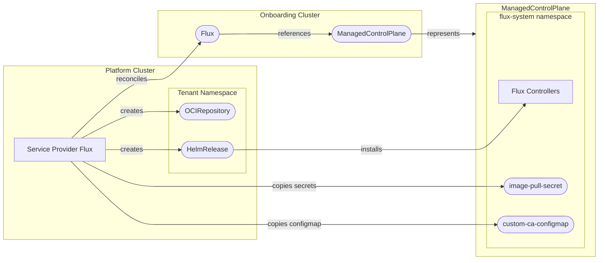

[](https://api.reuse.software/info/github.com/openmcp-project/service-provider-flux)

# 🚀 service-provider-flux

A service provider for managing [FluxCD](https://fluxcd.io/) deployments within a ManagedControlPlane environment. This provider enables GitOps capabilities by automatically installing and configuring Flux on managed control planes.

## 📖 Overview

The Flux service provider automates the lifecycle management of Flux installations, including:

- 🔄 **Automated Flux Deployment** - Deploys Flux via Helm to ManagedControlPlanes
- 🔐 **Air-Gapped Support** - Full support for private registries and air-gapped environments
- 🔑 **Secret Management** - Automatic copying of registry credentials across cluster boundaries
- 📊 **Status Tracking** - Real-time status reporting of all managed resources

## 🏗️ Architecture



## 🚦 Getting Started

### Prerequisites

- Go 1.21+
- [Task](https://taskfile.dev/) (task runner)
- Docker (for building images)
- Access to an openMCP environment

### 🛠️ Local Development

1. **Clone the repository**

   ```bash
   git clone https://github.com/openmcp-project/service-provider-flux.git
   cd service-provider-flux
   ```

2. **Install dependencies**

   ```bash
   go mod download
   ```

3. **Build the binary**

   ```bash
   task build
   ```

4. **Run tests**

   ```bash
   task test
   ```

5. **Build the container image**

   ```bash
   task build:img:build
   ```

### 🧪 Running End-to-End Tests

```bash
task test-e2e
```

This will build the image and run the full e2e test suite.

## 📦 Installation

To install the Flux service provider, create a `ServiceProvider` resource in your platform cluster:

```yaml
apiVersion: openmcp.cloud/v1alpha1
kind: ServiceProvider
metadata:
  name: flux
  namespace: openmcp-system
spec:
  image: ghcr.io/openmcp-project/images/service-provider-flux:v0.1.0
```

## 📝 API Reference

### Flux

The `Flux` resource represents a Flux installation on a ManagedControlPlane.

```yaml
apiVersion: flux.services.open-control-plane.io/v1alpha1
kind: Flux
metadata:
  name: my-flux
  namespace: default
spec:
  version: "2.8.3"
```

| Field          | Type   | Description                    |
| -------------- | ------ | ------------------------------ |
| `spec.version` | string | The version of Flux to install |

Note that any version that should be available to users have to be defined in the `ProviderConfig`.

### ProviderConfig

The `ProviderConfig` resource configures deployment settings for each version of Flux that the service provider supports.

```yaml
apiVersion: flux.services.open-control-plane.io/v1alpha1
kind: ProviderConfig
metadata:
  name: flux
spec:
  # Optional: Reconciliation interval
  pollInterval: "5m"
  # Optional: ConfigMapKeySelector for a custom ca bundle (configmap will be copied to ManagedControlPlane)
  caBundleRef:
    name: "custom-ca-bundle"
    key: "ca-bundle.crt"
  # The Flux versions that can be installed
  versions:
    - version: "2.8.3"
      # Flux Helm chart version
      chartVersion: "2.18.2"
      # Flux Helm chart location
      chartUrl: "oci://ghcr.io/fluxcd-community/charts/flux2"
      # Optional: Secret for private chart registry
      chartPullSecret: "chart-registry-credentials"
      # Optional: Custom Helm values
      values:
        # Image pull secrets for private registries (will be copied to ManagedControlPlane)
        imagePullSecrets:
          - name: "image-registry-credentials"

        # Custom controller images
        helmController:
          image: my-registry.example.com/fluxcd/helm-controller
          tag: v1.5.3
        sourceController:
          image: my-registry.example.com/fluxcd/source-controller
          tag: v1.8.1
```

| Field               | Type                 | Description                                                        |
| ------------------- | -------------------- | ------------------------------------------------------------------ |
| `spec.pollInterval` | duration             | How often to reconcile resources (default: 1m)                     |
| `spec.certSecretRef`| object               | SecretRef for chart registry trust establishment                   |
| `spec.caBundleRef`  | ConfigMapKeySelector | A configmap with a ca bundle used by Flux to verify certificates   |
| `spec.versions`     | array                | The versions of Flux that can be installed                         |

A **caBundleRef** is defined as follows:

| Field | Type | Description |
|-------|------|-------------|
| `name` | string | The name of the configmap which holds the ca bundle |
| `key` | string | The key in the configmap under which the ca bundle is stored |

A **version** item is defined as follows:

| Field             | Type   | Description                                   |
| ----------------- | ------ | --------------------------------------------- |
| `version`         | string | The Flux version that this item defines       |
| `chartVersion`    | string | The Flux Helm chart version to install        |
| `chartUrl`        | string | OCI registry URL for the Flux Helm chart      |
| `chartPullSecret` | string | Secret name for chart registry authentication |
| `values`          | object | Custom Helm values for Flux deployment        |

## 🔐 Air-Gapped Environments

For air-gapped or enterprise environments, see the [Image Localization Guide](docs/configuration/image-localization.md).

## 🔧 Development Tasks

| Command                | Description                |
| ---------------------- | -------------------------- |
| `task build`           | Build the binary           |
| `task build:img:build` | Build the container image  |
| `task test`            | Run unit tests             |
| `task test-e2e`        | Run end-to-end tests       |
| `task generate`        | Generate CRDs and code     |
| `task validate`        | Run linters and formatters |

## Quality Criteria

[](https://open-control-plane.io/developers/serviceprovider/quality-criteria)

| Criterion                         | Status | Notes                                                                                                                                                                                                                                                                        |
| --------------------------------- | :----: | ---------------------------------------------------------------------------------------------------------------------------------------------------------------------------------------------------------------------------------------------------------------------------- |
| Deletion behaviour                |   ⚠️    | A finalizer ensures the Service Provider managed resources like Flux' `OCIRepository` and `HelmRelease` are cleaned-up. But there is no behaviour that ensures deletion is blocked if custom resources (e.g. Flux' `GitRepository` objects) in a `ControlPlane` still exist. |
| Status reporting & error messages |   ✅    |                                                                                                                                                                                                                                                                              |
| Operation annotations             |   ⚠️    | `openmcp.cloud/operation: ignore` is processed by [opencontrolplane-runtime](https://github.com/openmcp-project/opencontrolplane-runtime). `openmcp.cloud/operation: reconcile` is not processed.                                                                            |
| API stability policy              |   ✅    |                                                                                                                                                                                                                                                                              |
| Custom CA support                 |   ✅    | Private-registry pull secrets and custom CA bundle propagation to Flux components is supported.                                                                                                                                                               |
| Release artifacts (image + OCM)   |   ✅    |                                                                                                                                                                                                                                                                              |
| Testing                           |   ✅    |                                                                                                                                                                                                                                                                              |
| Ownership and maintenance docs    |   ✅    |                                                                                                                                                                                                                                                                              |

See the [OpenControlPlane Quality Criteria](https://open-control-plane.io/developers/serviceprovider/quality-criteria) for definitions.

## 🤝 Support, Feedback, Contributing

This project is open to feature requests/suggestions, bug reports etc. via [GitHub issues](https://github.com/openmcp-project/service-provider-flux/issues). Contribution and feedback are encouraged and always welcome. For more information about how to contribute, the project structure, as well as additional contribution information, see our [Contribution Guidelines](https://github.com/openmcp-project/.github/blob/main/CONTRIBUTING.md).

## 🔒 Security / Disclosure

If you find any bug that may be a security problem, please follow our instructions at [in our security policy](https://github.com/openmcp-project/service-provider-flux/security/policy) on how to report it. Please do not create GitHub issues for security-related doubts or problems.

## 📜 Code of Conduct

We as members, contributors, and leaders pledge to make participation in our community a harassment-free experience for everyone. By participating in this project, you agree to abide by its [Code of Conduct](https://github.com/openmcp-project/.github/blob/main/CODE_OF_CONDUCT.md) at all times.

## 📄 Licensing

"Flux" is a registered trademark of the Linux Foundation.

Copyright OpenControlPlane contributors. Please see our [LICENSE](LICENSE) for copyright and license information. Detailed information including third-party components and their licensing/copyright information is available [via the REUSE tool](https://api.reuse.software/info/github.com/openmcp-project/service-provider-flux).

---

<p align="center">
  <a href="https://apeirora.eu/content/projects/">
    
  </a>
</p>

<p align="center">
  OpenControlPlane is part of <a href="https://apeirora.eu/content/projects/">ApeiroRA</a>, an EU Important Project of Common European Interest (IPCEI-CIS).
</p>

<p align="center">
  Copyright Linux Foundation Europe. For web site terms of use, trademark policy and other project policies please see <a href="https://linuxfoundation.eu/en/policies">https://linuxfoundation.eu/en/policies</a>.
</p>
