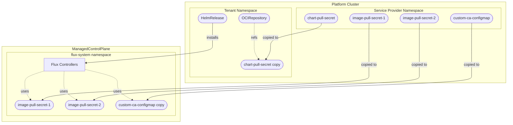

# Air-Gapped Environment Configuration

This document describes how to configure the Flux service provider for air-gapped or enterprise environments where images and Helm charts need to be pulled from private registries.

## Overview

In air-gapped environments, you typically need to:

1. **Mirror the Flux Helm chart** to your internal OCI registry
2. **Mirror Flux controller images** to your internal container registry
3. **Configure authentication** for both chart and image pulls

The Flux service provider handles this through:

- **`chartPullSecret`**: Credentials for pulling the Helm chart from a private OCI registry
- **`values.imagePullSecrets`**: Credentials for pulling Flux controller images (specified in Helm values)
- **`values`**: Custom Helm values for image location overrides
- **`caBundleRef`**: PEM-encoded custom ca bundle if your private OCI registry uses self-signed certificates

## Secret Flow



## Configuration

### ProviderConfig

```yaml
apiVersion: flux.services.open-control-plane.io/v1alpha1
kind: ProviderConfig
metadata:
  name: flux-provider-config
spec:
  # ConfigMapKeySelector pointing to a configmap which holds a PEM-encoded custom CA bundle.
  # Must exist in the service provider's namespace on the platform cluster
  # The configmap will be automatically copied from the service provider's namespace
  # to the flux-system namespace on the ManagedControlPlane and configured 
  # for the flux-controllers
  caBundleRef:
    name: "custom-ca-bundle"
    key: "ca-bundle.crt"
  versions:
    - version: "2.8.3"
      chartVersion: "2.18.2"
      # Flux Helm chart location (private OCI registry)
      chartUrl: "oci://registry.internal.corp/charts/flux2"

      # Secret for authenticating to the chart OCI registry
      # Must exist in the service provider's namespace on the platform cluster
      # Will be copied to the tenant namespace on the platform cluster
      chartPullSecret: "chart-registry-credentials"

      # Helm values for Flux deployment
      values:
        # Image pull secrets for Flux controllers
        # These secrets will be automatically copied from the service provider's namespace
        # to the flux-system namespace on the ManagedControlPlane
        imagePullSecrets:
          - name: "image-registry-credentials"

        # Image location overrides
        helmController:
          image: registry.internal.corp/fluxcd/helm-controller
        sourceController:
          image: registry.internal.corp/fluxcd/source-controller
        kustomizeController:
          image: registry.internal.corp/fluxcd/kustomize-controller
        notificationController:
          image: registry.internal.corp/fluxcd/notification-controller
```

### Creating Secrets

Secrets must be created in the service provider's namespace on the platform cluster (the namespace where the service provider pod runs):

```bash
# Chart pull secret (for OCI registry authentication)
kubectl create secret docker-registry chart-registry-credentials \
  --namespace <service-provider-namespace> \
  --docker-server=registry.internal.corp \
  --docker-username=<username> \
  --docker-password=<password>

# Image pull secret (for container image authentication)
kubectl create secret docker-registry image-registry-credentials \
  --namespace <service-provider-namespace> \
  --docker-server=registry.internal.corp \
  --docker-username=<username> \
  --docker-password=<password>
```

### Creating Custom CA ConfigMap

Concatenate all your custom CA certificates into a single PEM file. Each certificate must use the standard PEM format.

```shell
cat /path/to/ca1.crt /path/to/ca2.crt > ca-bundle.crt
```

The resulting file should look like this:

```text title="ca-bundle.crt"
-----BEGIN CERTIFICATE-----
MIIDXTCCAkWgAwIBAgIJAMSO...
-----END CERTIFICATE-----
-----BEGIN CERTIFICATE-----
MIIDXTCCAkWgAwIBAgIJANPQ...
-----END CERTIFICATE-----
```

Create the configmap

```shell
kubectl create configmap custom-ca-bundle \
  --from-file=ca-bundle.crt=ca-bundle.crt \
  --namespace=openmcp-system
```

## How It Works

### Chart Pull Secret

1. The secret specified in `chartPullSecret` is copied from the service provider's namespace to the tenant namespace on the platform cluster
2. The `OCIRepository` resource references this secret via `spec.secretRef`
3. The Flux Source Controller uses this secret to authenticate when pulling the Helm chart

### Image Pull Secrets

1. Secrets specified in `values.imagePullSecrets` are extracted from the Helm values
2. These secrets are copied from the service provider's namespace on the platform cluster to `flux-system` on the ManagedControlPlane
3. The Helm values are passed through to Flux, which configures the controller pods with these secrets

### Custom CA Bundle
1. The configmap specified in `caBundleRef` is copied from the service provider's namespace on the platform cluster to `flux-system` on the ManagedControlPlane
2. For each Flux controller, the Helm values are adjusted so that it mounts the provided `caBundleRef.key` and sets the `SSL_CERT_DIR` environment variable to add the bundle to the pool of known certificates
3. The Helm values are passed through to Flux, and each Flux controller is able to verify certificates signed by the provided custom CA

[!CAUTION] The custom CA certificate is not propagated to the OpenControlPlane cluster nodes. If you want to pull images from the same OCI registry you must add the custom CA certificate to the cluster nodes yourself.

## Complete Example

### Air-Gapped Setup

```yaml
apiVersion: flux.services.open-control-plane.io/v1alpha1
kind: ProviderConfig
metadata:
  name: flux-airgapped
spec:
  chartUrl: "oci://harbor.corp.internal/charts/flux2"
  chartPullSecret: "harbor-credentials"
  caBundleRef:
    name: "harbor-ca-bundle"
    key: "harbor-ca-bundle.crt"
  values:
    # Image pull secrets - will be copied to ManagedControlPlane
    imagePullSecrets:
      - name: "harbor-credentials"

    # Controller image overrides
    helmController:
      image: harbor.corp.internal/fluxcd/helm-controller
    sourceController:
      image: harbor.corp.internal/fluxcd/source-controller
    kustomizeController:
      image: harbor.corp.internal/fluxcd/kustomize-controller
    notificationController:
      image: harbor.corp.internal/fluxcd/notification-controller
    imageAutomationController:
      image: harbor.corp.internal/fluxcd/image-automation-controller
      create: false  # Disable if not needed
    imageReflectorController:
      image: harbor.corp.internal/fluxcd/image-reflector-controller
      create: false  # Disable if not needed
```

## Mirroring Images

To mirror FluxCD images to your internal registry:

```bash
# Mirror Helm chart
skopeo copy \
  docker://ghcr.io/fluxcd-community/charts/flux2:2.x.x \
  docker://harbor.corp.internal/charts/flux2:2.x.x

# Mirror controller images
for img in helm-controller source-controller kustomize-controller notification-controller; do
  skopeo copy \
    docker://ghcr.io/fluxcd/${img}:v1.x.x \
    docker://harbor.corp.internal/fluxcd/${img}:v1.x.x
done
```

## Troubleshooting

### Check Secret Copying

Verify secrets are copied to the correct namespaces:

```bash
# Platform cluster - tenant namespace
kubectl get secrets -n mcp--<tenant-id> | grep -E "chart|image"

# ManagedControlPlane - flux-system namespace
kubectl get secrets -n flux-system | grep -E "image"
```

### Check ConfigMap Copying
Verify configmaps are copied to the correct namespaces:

```bash
# ManagedControlPlane - flux-system namespace
kubectl get cm -n flux-system | grep -E "<configmap-name>"
```

### Check OCIRepository Secret Reference

```bash
kubectl get ocirepository flux -n mcp--<tenant-id> -o jsonpath='{.spec.secretRef}'
```

### Check HelmRelease Values

```bash
kubectl get helmrelease flux -n mcp--<tenant-id> -o jsonpath='{.spec.values}' | jq .
```

### Check Pod Image Pull Secrets

On the ManagedControlPlane:

```bash
kubectl get pods -n flux-system -o jsonpath='{range .items[*]}{.metadata.name}{"\t"}{.spec.imagePullSecrets[*].name}{"\n"}{end}'
```
