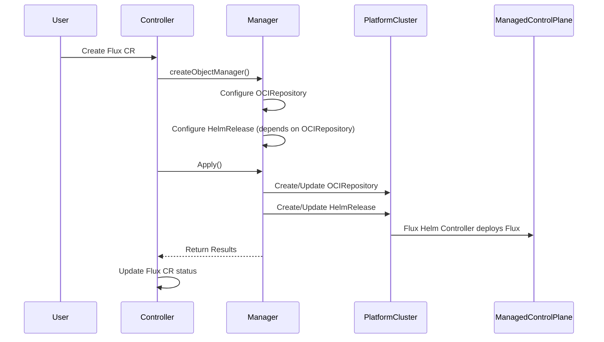
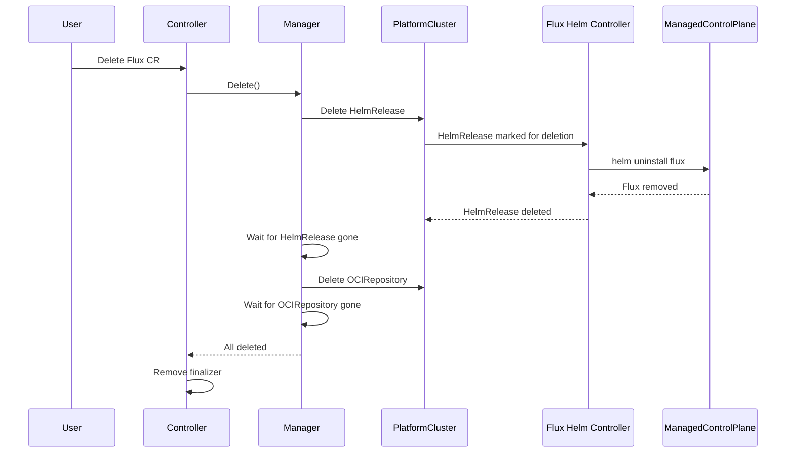

# Flux Service Provider - Manager Pattern

This document describes the Manager pattern used by the Flux service provider to orchestrate Kubernetes resources across clusters.

## Overview

The Manager pattern provides a structured approach to managing Kubernetes objects across multiple clusters with proper dependency ordering, status tracking, and deletion handling.



## Core Components

### Manager

The Manager orchestrates the lifecycle of managed Kubernetes objects. It handles both apply (create/update) and delete operations while respecting dependencies between objects.

Key responsibilities:
- Manages multiple `ManagedCluster` instances
- Ensures dependencies exist before creating dependent objects
- During deletion, waits for resources to be fully removed (not just deletion requested)
- Supports orphaning resources during deletion

### ManagedObject

Represents a single Kubernetes object under management. Each object declares:
- Its reconciliation logic
- Dependencies on other ManagedObjects
- Deletion policy (Delete or Orphan)
- Status reporting function

### ManagedCluster

Represents a Kubernetes cluster that hosts managed objects. Provides:
- Client access to the cluster
- Cluster type identification (Platform or ManagedControlPlane)
- Collection of objects to manage in that cluster

## Deletion Handling

The Manager ensures proper cleanup when a Flux CR (on the onboarding cluster) is deleted:



The key insight is that the Manager waits for actual resource deletion, not just the deletion request. This ensures:

1. The HelmRelease's `spec.uninstall` configuration is honored
2. The Flux Helm Controller has time to run `helm uninstall` on the ManagedControlPlane
3. Cluster access (kubeconfig) remains available until cleanup completes
4. No orphaned Flux deployments remain on the ManagedControlPlane

## Usage

```go
// Create manager
mgr := flux.NewManager()

// Create platform cluster context
platformCluster := flux.NewManagedCluster(
    platformClient,
    restConfig,
    tenantNamespace,
    flux.PlatformCluster,
)

// Configure Flux resources
flux.Configure(platformCluster, mcpCluster, namespace, fluxCR, providerConfig, clusterContext, configureContext)

// Add cluster to manager
mgr.AddCluster(platformCluster)

// Apply resources (create/update)
results := mgr.Apply(ctx)

// Or delete resources
results := mgr.Delete(ctx)

// Check if all deletions complete
if flux.AllDeleted(results) {
    // Safe to remove finalizer
}
```

## Benefits

1. **Correctness**: Proper ordering ensures dependencies are met; deletion verification prevents orphaned resources
2. **Observability**: Per-resource status with phase, message, and location
3. **Maintainability**: Clean separation between resource configuration and lifecycle management
4. **Consistency**: Same pattern used across service providers (e.g., service-provider-external-secrets)
